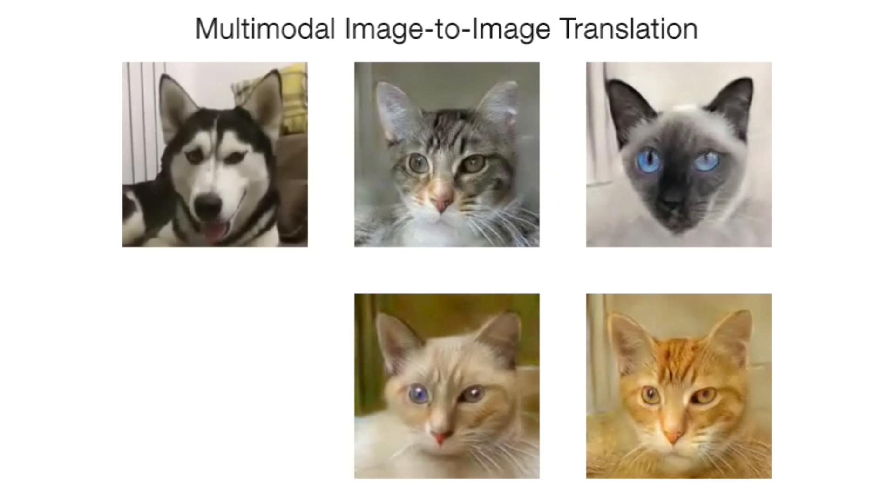
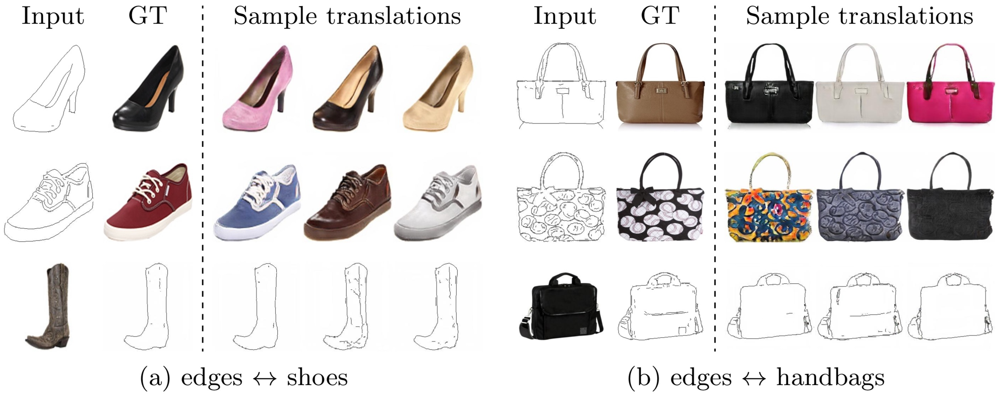
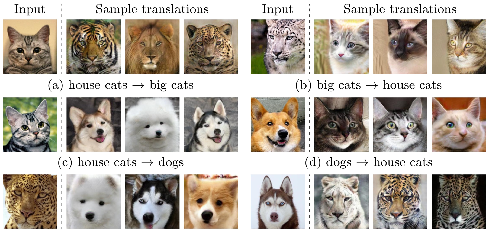
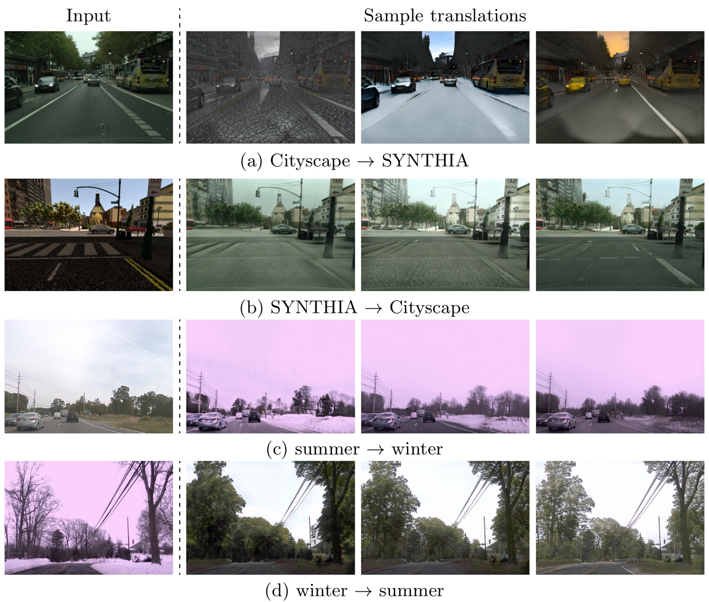
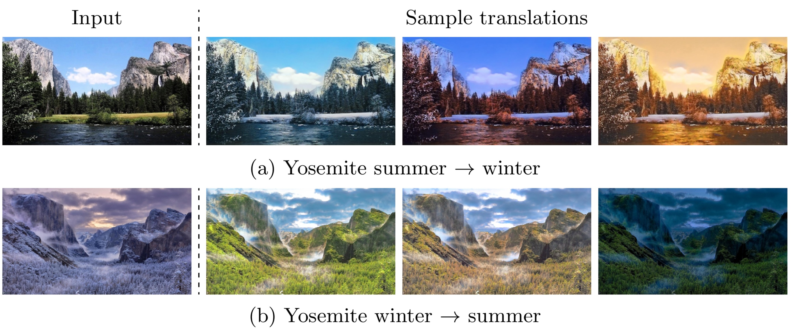
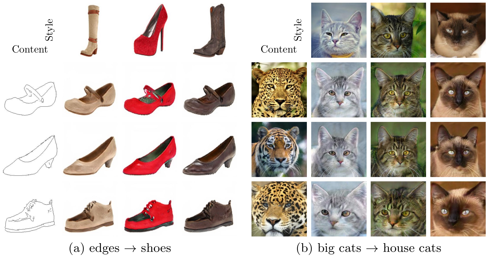

**The code base is no longer maintained.**

**Please check here for an improved implementation of MUNIT: https://github.com/NVlabs/imaginaire/tree/master/projects/munit**

[](https://raw.githubusercontent.com/NVIDIA/FastPhotoStyle/master/LICENSE.md)


## MUNIT: Multimodal UNsupervised Image-to-image Translation

### License

Copyright (C) 2018 NVIDIA Corporation.  All rights reserved.
Licensed under the CC BY-NC-SA 4.0 license (https://creativecommons.org/licenses/by-nc-sa/4.0/legalcode). 

The code is released for academic research use only. For commercial use, please contact [researchinquiries@nvidia.com](researchinquiries@nvidia.com).

For press and other inquiries, please contact [Hector Marinez](hmarinez@nvidia.com)


### Code usage

Please check out the [user manual page](USAGE.md).

### Paper

[Xun Huang](http://www.cs.cornell.edu/~xhuang/), [Ming-Yu Liu](http://mingyuliu.net/), [Serge Belongie](https://vision.cornell.edu/se3/people/serge-belongie/), [Jan Kautz](http://jankautz.com/), "[Multimodal Unsupervised Image-to-Image Translation](https://arxiv.org/abs/1804.04732)", ECCV 2018

### Results Video
[](https://youtu.be/ab64TWzWn40)

### Edges to Shoes/handbags Translation



### Animal Image Translation



### Street Scene Translation



### Yosemite Summer to Winter Translation (HD)



### Example-guided Image Translation



### Other Implementations

[MUNIT-Tensorflow](https://github.com/taki0112/MUNIT-Tensorflow) by [Junho Kim](https://github.com/taki0112)

[MUNIT-keras](https://github.com/shaoanlu/MUNIT-keras) by [shaoanlu](https://github.com/shaoanlu)

### Citation

If you find this code useful for your research, please cite our paper:

```
@inproceedings{huang2018munit,
  title={Multimodal Unsupervised Image-to-image Translation},
  author={Huang, Xun and Liu, Ming-Yu and Belongie, Serge and Kautz, Jan},
  booktitle={ECCV},
  year={2018}
}
```


